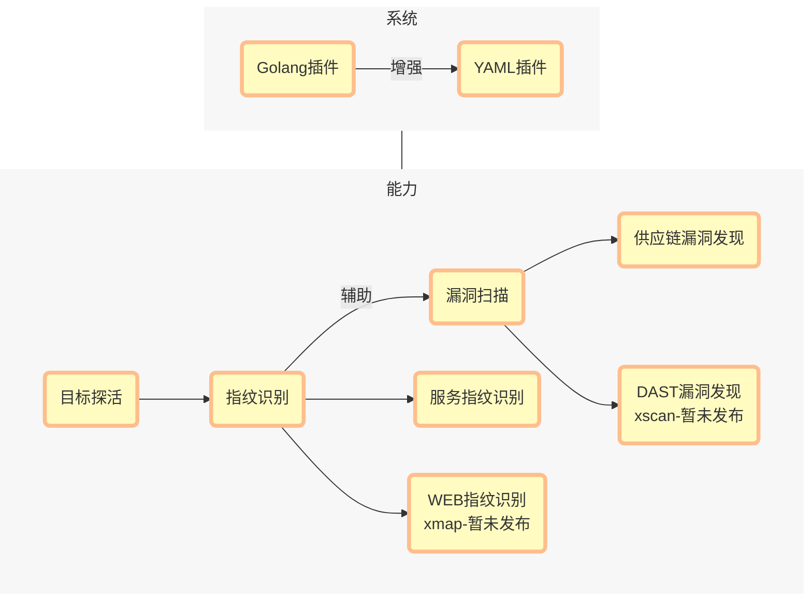

<p align="center">
  <picture>
    <source srcset="./img/logo.svg">
    
  </picture>
</p>

<h3 align="center">
    XPOC 安全能力概念验证框架
</h3>

<p align="center">
    <a href="https://github.com/chaitin/xpoc/releases">
        
    </a>

</p>

<p align="center">简洁的命令行工具，快速发现安全问题</p>
<p align="center">提供精选插件和灵活的自定义能力</p>



## 一键安装

windows:

```

```

linux:

```

```

mac:

```

```

## 执行扫描

xpoc -t http://testtest.fun
